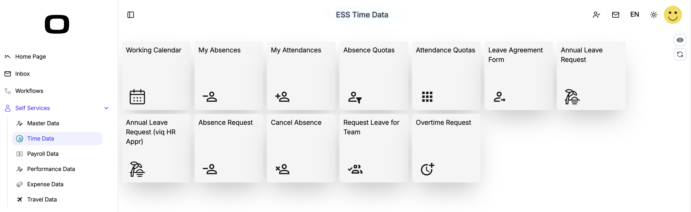

# OrchestraHCM Apps
Scheme Based Business Apps with UI Designs for Web and Mobile
# 
## Tile-Based Menu

### Business Requirement
Users need to accces their apps/links from web and mobile devices.
### Solution Scenerio
This app provides clean and simple UI for users to access their applications. This app is called tile-menu app and can be accessed by OrchestraHCM left menu.
### Download Files and Upload to your OrchestraHCM
Download [Screen](/orc.ess.tm.json), and make your changes according to your business requirements. No scheme need for this app, you can update tiles and screen according to your requirements.
