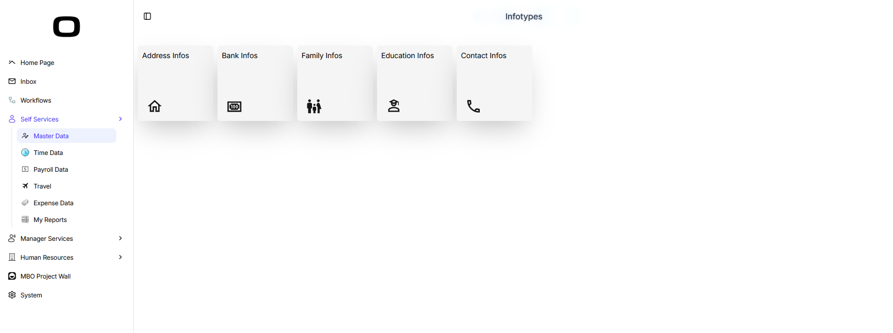
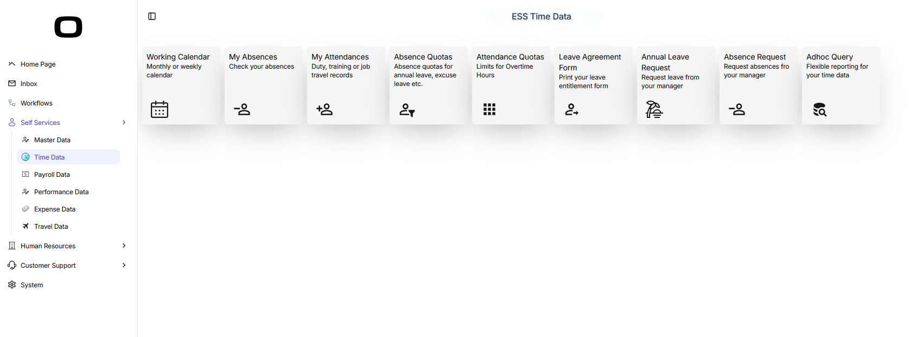
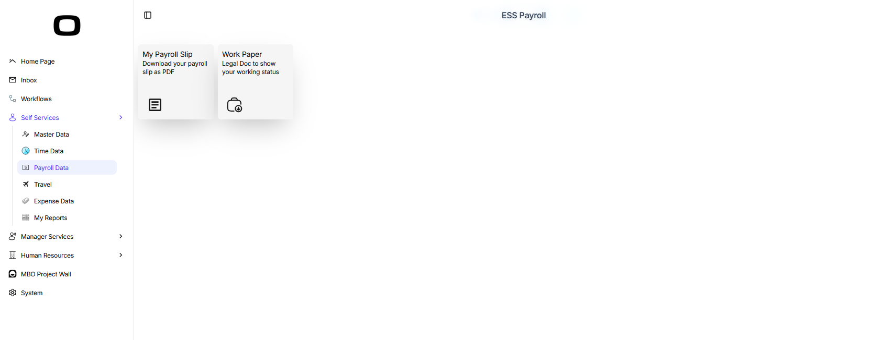
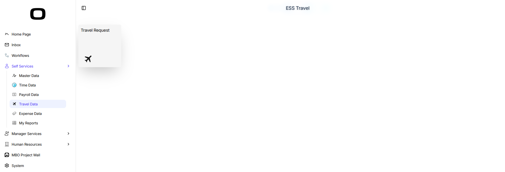
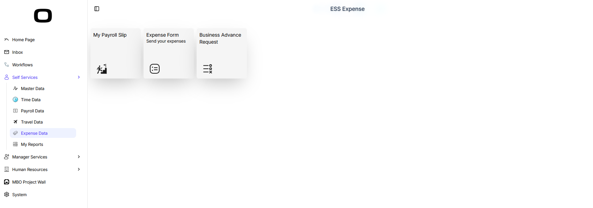
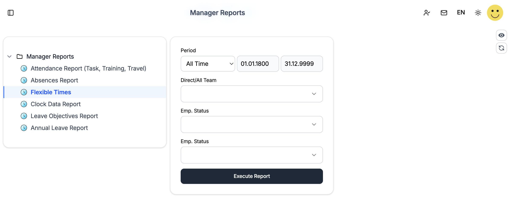

# OrchestraHCM Apps
Scheme Based Business Apps with UI Designs for Web and Mobile
# 
## Tile-Based ESS Menus

- [ESS Infotypes](#ess-infotypes) - Users can reach their infotypes by this menu
- [ESS Time Data](#ess-time-data) - Users can submit request (absence, attendance) to their managers and can reach their time datas by this menu
- [ESS Payroll Data](#ess-payroll-data) - Users can download their payroll and work paper by this menu
- [ESS Travel Data](#ess-travel-data) - Users can submit new travel request to their manager by this menu
- [ESS Expense Data](#ess-expense-data) - Users can submit expense form by this menu
# 
## ESS Report Tree Menu

- [ESS Reports](#ess-reports) - Users can reach their reports by this menu

## ESS Infotypes

### Business Requirement
Users need to accces their informations from web and mobile devices.
### Solution Scenerio
This tile-menu app that can be accessed by OrchestraHCM left menu provides clean and simple UI for users to access their infotypes.
### Download Files and Upload to OrchestraHCM
Download [Screen](/orc.ess.infotypes.json), and make your changes according to your business requirements. No scheme need for this app, you can update tiles and screen according to your requirements.
### Versions
- July 21, 2026 - Initial Commit

## ESS Time Data

### Business Requirement
Users need to submit an absence request to their manager from web and mobile devices.
### Solution Scenerio
This tile-menu app that can be accessed by OrchestraHCM left menu provides clean and simple UI for users to submit requests to their managers and reach their time datas.
### Download Files and Upload to OrchestraHCM
Download [Screen](/orc.ess.tm.json), and make your changes according to your business requirements. No scheme need for this app, you can update tiles and screen according to your requirements.
### Versions
- July 21, 2026 - Initial Commit

## ESS Payroll Data

### Business Requirement
Users need to view their payroll or work paper from web and mobile devices.
### Solution Scenerio
This tile-menu app that can be accessed by OrchestraHCM left menu provides clean and simple UI for users to download their payroll and work paper.
### Download Files and Upload to OrchestraHCM
Download [Screen](/orc.ess.py.json), and make your changes according to your business requirements. No scheme need for this app, you can update tiles and screen according to your requirements.
### Versions
- July 21, 2026 - Initial Commit

## ESS Travel Data

### Business Requirement
Users need to submit a travel request their manager from web and mobile devices.
### Solution Scenerio
This tile-menu app that can be accessed by OrchestraHCM left menu provides clean and simple UI for users to submit travel requests to their managers.
### Download Files and Upload to OrchestraHCM
Download [Screen](/orc.ess.trv.json), and make your changes according to your business requirements. No scheme need for this app, you can update tiles and screen according to your requirements.
### Versions
- July 21, 2026 - Initial Commit

## ESS Expense Data

### Business Requirement
Users need to submit an expense to their manager from web and mobile devices.
### Solution Scenerio
This tile-menu app that can be accessed by OrchestraHCM left menu provides clean and simple UI for users to submit their expenses to their managers.
### Download Files and Upload to OrchestraHCM
Download [Screen](/orc.ess.exp.json), and make your changes according to your business requirements. No scheme need for this app, you can update tiles and screen according to your requirements.
### Versions
- July 21, 2026 - Initial Commit

## Report Tree Menu

### Business Requirement
Users need to create a simple report tree for managers.
### Solution Scenerio
This app provides report tree for users. Raport nodes should be filled by an exit program called by PROG from scheme.
### Download Files and Upload to your OrchestraHCM
Download [Screen](/orc.mss.reports.json) and [Scheme](/MSS_REPORTS.json) and make your changes according to your business requirements. No scheme need for this app, you can update tiles and screen according to your requirements.
Also download exit program for creating nodes, [Program](/MSS_REPORTS.ts)

<details>
<summary>MSS_REPORTS.ts</summary>

```typescript
// page: IPageDesign
// container: IContainer

function run(page: IPageDesign, container: IContainer) {
  const pernr = container.UserPernr;
  const lang = page.Langu;

  let _executeIcon: string = "streamline-ultimate-color:time-clock-circle";

  page.Messages = page.Messages || [];
  page.Messages.push({
    Title: "INFO",
    Text: `Program calisti: ${pernr} / ${lang}`,
    IsError: false
  });

  var _reportViewer = page.Elements.filter(o => o.FieldName === "reportViewer")[0];

  if (_reportViewer) {
    if (container.Langu == "TR") {
      // _reportViewer.Title = "Yönetici Raporları";
      // _reportViewer.SubTitle = "";
      _reportViewer.Nodes = [
        {
          IconName: "material-symbols:folder-outline",
          NodeId: "Node1",
          NodeText: "Yönetici Raporları",
          Expanded: false,
          Selected: false,
          IsPostBack: false,
          ToolTip: "İnsan Kaynakları Raporları zaman yönetimi bordro, dsksjd skdjskd kşdsjşksşd",
          Children: [
            {
              IconName: _executeIcon,
              NodeId: "repMSS2002",
              NodeText: "Devam (Görev, Eğitim, Seyahat) Raporu",
              Expanded: false,
              Selected: false,
              IsPostBack: false,

            },
            {
              IconName: _executeIcon,
              NodeId: "repMSS2001",
              NodeText: "Devamsızlık Raporu",
              Expanded: false,
              Selected: false,
              IsPostBack: false
            },
            {
              IconName: _executeIcon,
              NodeId: "repMSSEsnek",
              NodeText: "Esnek Çalışma Raporu",
              Expanded: false,
              Selected: false,
              IsPostBack: false
            },
            {
              IconName: _executeIcon,
              NodeId: "repMSS2011",
              NodeText: "Kart Hareketleri Raporu",
              Expanded: false,
              Selected: false,
              IsPostBack: false
            },
            {
              IconName: _executeIcon,
              NodeId: "repMSS20061",
              NodeText: "İzin Hedefleri Raporu",
              Expanded: false,
              Selected: false,
              IsPostBack: false
            },
            {
              IconName: _executeIcon,
              NodeId: "repMSS20062",
              NodeText: "Yıllık İzin Raporu",
              Expanded: false,
              Selected: false,
              IsPostBack: false
            }
          ]
        }

      ]
    }
    else {
      // _reportViewer.Title = "Manager Reports";
      // _reportViewer.SubTitle = "";
      _reportViewer.Nodes = [
        {
          IconName: "material-symbols:folder-outline",
          NodeId: "Node1",
          NodeText: "Manager Reports",
          Expanded: false,
          Selected: false,
          IsPostBack: false,
          ToolTip: "",
          Children: [
            {
              IconName: _executeIcon,
              NodeId: "repMSS2002",
              NodeText: "Attendance Report (Task, Training, Travel)",
              Expanded: false,
              Selected: false,
              IsPostBack: false,

            },
            {
              IconName: _executeIcon,
              NodeId: "repMSS2001",
              NodeText: "Absences Report",
              Expanded: false,
              Selected: false,
              IsPostBack: false
            },
            {
              IconName: _executeIcon,
              NodeId: "repMSSEsnek",
              NodeText: "Flexible Times",
              Expanded: false,
              Selected: false,
              IsPostBack: false
            },
            {
              IconName: _executeIcon,
              NodeId: "repMSS2011",
              NodeText: "Clock Data Report",
              Expanded: false,
              Selected: false,
              IsPostBack: false
            },
            {
              IconName: _executeIcon,
              NodeId: "repMSS20061",
              NodeText: "Leave Objectives Report",
              Expanded: false,
              Selected: false,
              IsPostBack: false
            },
            {
              IconName: _executeIcon,
              NodeId: "repMSS20062",
              NodeText: "Annual Leave Report",
              Expanded: false,
              Selected: false,
              IsPostBack: false
            }
          ]
        }

      ]
    }

  }

  return {
    continueNext: true,
    page,
    container
  };
}
```

</details>
